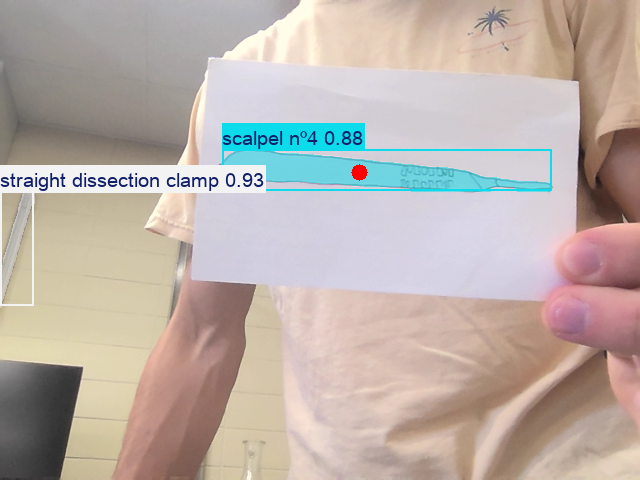
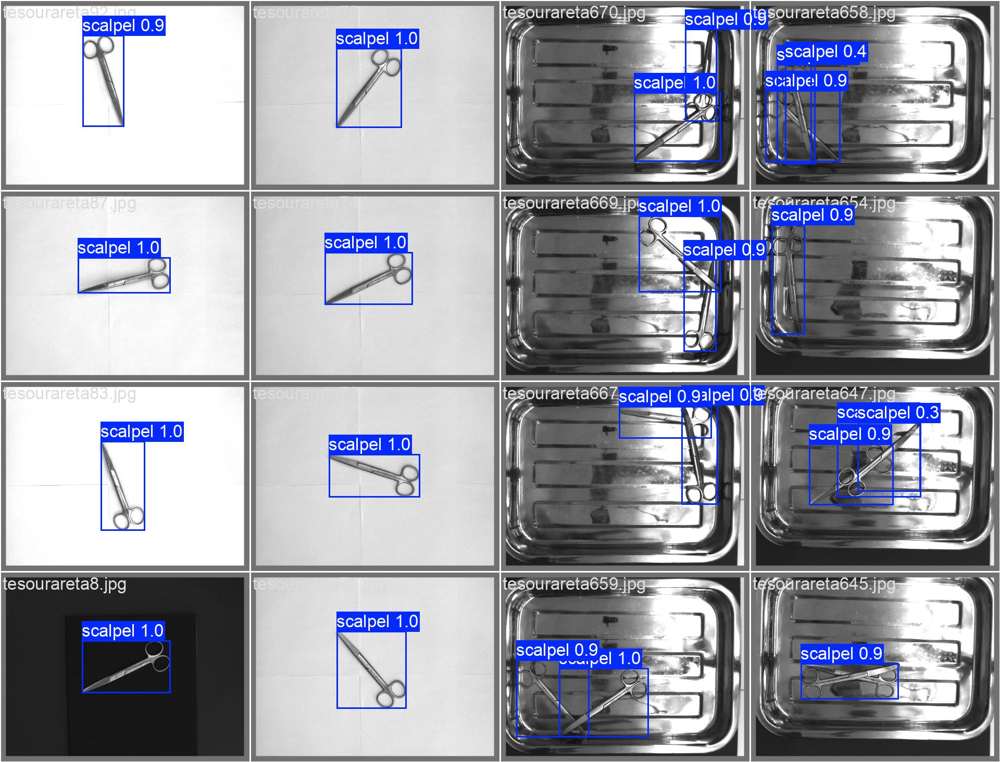
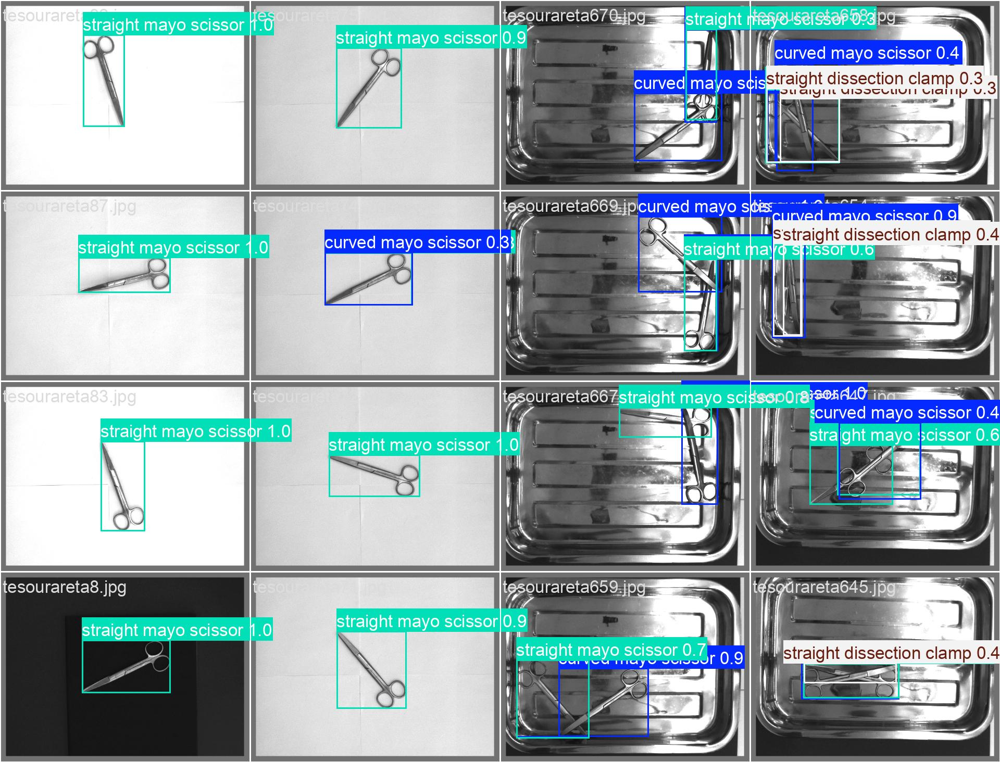

# Surgical Tool Segmentation

YOLO-based surgical tool detection project for robotic healthcare applications. This repository packages my computer vision work into a standalone repo with real-time inference scripts, trained weights, environment files, and example outputs.

## Overview

This project explores surgical tool detection using Ultralytics YOLO in a robotic healthcare context. The repository includes live inference scripts, a trained model checkpoint, exported environment files, and saved outputs from both training and inference workflows.

This repo is a cleaned standalone packaging of my YOLO-related work from a larger interdisciplinary project repository. Only the computer vision components relevant to surgical tool detection are included here.

## Repository Structure

    surgical-tool-segmentation/
    ├── src/
    │   ├── inference/
    │   │   ├── find_cameras.py
    │   │   ├── yolo_stream.py
    │   │   └── yolo_stream_detect.py
    │   └── training/
    ├── assets/
    │   ├── demos/
    │   │   └── output_detected.mp4
    │   └── images/
    ├── docs/
    │   ├── conda_packages.txt
    │   ├── requirements_full.txt
    │   ├── y8n_50ep_args.yaml
    │   └── y8n_multiclass_args.yaml
    ├── models/
    │   └── best.pt
    ├── results/
    │   ├── metrics/
    │   │   ├── y8n_50ep_results.csv
    │   │   ├── y8n_50ep_results.png
    │   │   ├── y8n_50ep_confusion_matrix.png
    │   │   ├── y8n_50ep_confusion_matrix_normalized.png
    │   │   ├── y8n_50ep_BoxPR_curve.png
    │   │   ├── y8n_multiclass_results.csv
    │   │   ├── y8n_multiclass_results.png
    │   │   ├── y8n_multiclass_confusion_matrix.png
    │   │   ├── y8n_multiclass_confusion_matrix_normalized.png
    │   │   └── y8n_multiclass_BoxPR_curve.png
    │   └── predictions/
    │       ├── detected_object.png
    │       ├── y8n_50ep_val_batch0_pred.jpg
    │       └── y8n_multiclass_val_batch0_pred.jpg
    ├── .gitignore
    ├── environment.yml
    ├── README.md
    └── requirements.txt

## Features

- YOLO-based surgical tool detection
- Real-time streaming inference
- Camera discovery utility
- Trained model checkpoint included
- Saved training metrics and prediction examples
- Conda and pip environment setup files

## Training Summary

The strongest featured training run in this repository is `y8n_50ep`, trained with:

- Model: `yolov8n.pt`
- Task: object detection
- Epochs: 50
- Image size: 640
- Batch size: 16

An additional experimental run, `y8n_multiclass`, is also included for comparison.

## Results

### Featured Run: `y8n_50ep`

Final epoch metrics:

- Precision: **0.9802**
- Recall: **0.9688**
- mAP@50: **0.9913**
- mAP@50:95: **0.9237**

### Additional Run: `y8n_multiclass`

Final epoch metrics:

- Precision: **0.9376**
- Recall: **0.9317**
- mAP@50: **0.9796**
- mAP@50:95: **0.9082**

## Example Outputs

Featured prediction output:

Additional validation predictions:

## Key Files

- `src/inference/yolo_stream_detect.py`  
  Main real-time detection script for live inference

- `src/inference/yolo_stream.py`  
  Alternate streaming inference script

- `src/inference/find_cameras.py`  
  Utility script for checking available cameras

- `models/best.pt`  
  Trained model weights

- `environment.yml`  
  Exported Conda environment from the working setup used for this project

- `requirements.txt`  
  Pip-based dependency list for a lighter install path

## Setup

Clone the repository:

    git clone https://github.com/spirofokas55/surgical-tool-segmentation.git
    cd surgical-tool-segmentation

## Recommended: Conda Environment Setup

Create the environment from the exported file:

    conda env create -f environment.yml
    conda activate surgical-tool-segmentation

## Alternative: Pip Setup

Install dependencies with pip:

    pip install -r requirements.txt

## Usage

Run camera discovery:

    python src/inference/find_cameras.py

Run detection:

    python src/inference/yolo_stream_detect.py

## Notes

- `environment.yml` is the main reproducibility file for this project
- `requirements.txt` is included as a lighter installation option
- The repository does not include the full original dataset
- This repo focuses on packaging, inference, and training outputs from the surgical tool detection workflow

## Future Improvements

- Add dataset details and class labels
- Add training scripts used for the featured runs
- Add benchmark notes for hardware and runtime
- Add more demo visuals and qualitative examples
- Expand the project toward tighter integration with robotic healthcare workflows